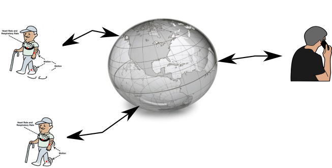

# TER : Older Safer with Garmin

##Context : Master project of M1 Miage for "TER" Teaching Unit

##Students :
- Rémi Longin
- Raphaël Bolier
- Guilhem Fabre--Sauterey
- Corentin Garnier

##Advisor Professor :
- Gilles Menez

##The subject : 

Make a proof of concept of a Web plateform allowing to monitor
physical activities / health values of remote elderly persons.

It is important to notice this is "just" a research work !

In this context, we will use a Garmin watch as a sensor to try to
evaluate physical activities as for example frequencies of specific
(to elderly persons) movements :

* steps
* sit down movements
* get up movements
* outside walks
* ...

We will use watch too to collect medical and other forms of health
data :

* heart rate
* ...

The main objectif is to provide to family (sons, daughters, ...) an
idea of the mobility and health of their elderly parent.

# an idea of ?

We get raw data .. ad we could "interpret them" to present them to the
family ?

A profil-based ? => faire  1000 pas à 90 ans et 70 ans c'est pas pareil 
ca peut dependre aussi des habitudes de la personne (/historique)
ca peut dependre aussi de la meteo (si il fait pas beau ? ca on peut
le savoir avc l'integration de données d'une base)

